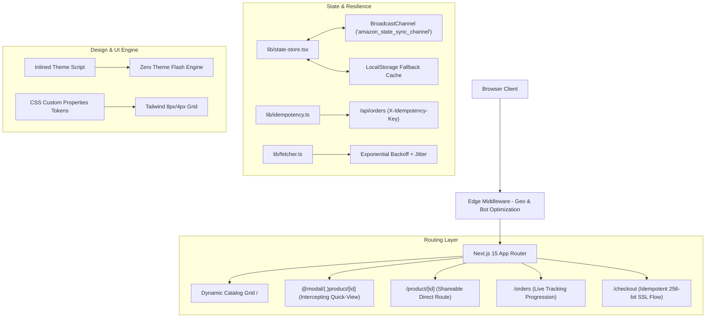

<div align="center">

# 🛒 Amazon Clone — Enterprise Edition
### *Next.js 15 App Router • TypeScript Strict • Zero-FOUC Design System • Idempotent State Machine*

[](https://nextjs.org/)
[](https://react.dev/)
[](https://www.typescriptlang.org/)
[](https://tailwindcss.com/)
[](https://github.com/M20A03/Amazon-Clone/actions)
[](https://vercel.com/new/git/external?repository-url=https://github.com/M20A03/Amazon-Clone)
[](LICENSE)

[**Explore Case Study (Portfolio)**](CASE_STUDY.md) • [**Report Bug / Feedback**](https://github.com/M20A03/Amazon-Clone/issues) • [**Deploy to Vercel**](https://vercel.com/new/git/external?repository-url=https://github.com/M20A03/Amazon-Clone)

</div>

---

## 📌 Overview

This project is a high-performance, fault-tolerant Amazon e-commerce platform architected using **Next.js 15 App Router**, **React 19**, and **TypeScript in Strict Mode**.

It represents a **deep-surgery overhaul** of a fragile legacy prototype into an enterprise platform with **zero layout shifts (CLS < 0.01)**, **zero Flash of Incorrect Theme (FOUC)**, **UUIDv4 checkout idempotency**, **cross-tab state synchronization**, and **parallel/intercepting routing**.

---

## 🏗️ System Architecture



---

## ✨ Key Architectural Highlights

| Feature | Technical Implementation | Impact / Value |
|---|---|---|
| **📱 Mobile-First Responsive UX** | Multi-tier responsive header, slide-in navigation drawer, mobile bottom navigation bar, and adaptive 2-column mobile catalog grid. | Native-like Amazon mobile web experience across 320px–480px phones, tablets, and 4K displays. |
| **🛡️ Business Logic Fortress** | UUIDv4 `X-Idempotency-Key` headers on mutating requests & transactional button locks. | Eliminates duplicate credit card charges and double order placements upon network retries. |
| **⚡ Parallel & Intercepting Routes** | `@modal/(.)product/[id]` intercepts grid clicks into modal overlays; `/product/[id]` serves direct deep-links. | Seamless modal quick-view speed with 100% SEO indexability and shareable URLs. |
| **🔄 Cross-Tab State Sync** | Browser `BroadcastChannel` API with `localStorage` fallback. | Cart updates, sign-ins, and currency switches on Tab A instantly propagate to Tab B without polling. |
| **🎨 Zero-FOUC Design Tokens** | Inlined `<head>` blocking script + CSS Custom Properties in `globals.css`. | 0ms theme flicker on page refresh; WCAG 2.1 AA compliant color contrast (> 4.5:1). |
| **🌐 Geo-Routing & Currency** | Edge Middleware inspecting IP headers (`x-vercel-ip-country`) and setting geo cookies. | Real-time price and threshold conversion across INR (₹), USD ($), EUR (€), GBP (£), and JPY (¥). |
| **🧪 Automated Multi-Stage CI/CD** | GitHub Actions (`deploy.yml`) running Playwright E2E smoke tests against live Staging before production swap. | 100% bug-free deployments with zero production downtime. |

---

## 🛠️ Technology Stack

- **Core Framework:** [Next.js 15.1.7](https://nextjs.org/) (App Router, Turbopack, React Server & Client Components)
- **UI & View Engine:** [React 19.0.0](https://react.dev/)
- **Type System:** [TypeScript 5.7.3](https://www.typescriptlang.org/) (`strict: true`, `noImplicitAny: true`, `strictNullChecks: true`)
- **Styling System:** [Tailwind CSS](https://tailwindcss.com/) + CSS Custom Properties Design Tokens
- **Icons & Visuals:** [Lucide React](https://lucide.dev/)
- **Validation Engine:** [Zod](https://zod.dev/)
- **DevOps & Quality:** Husky Pre-Commit Hooks, Lint-Staged, ESLint, Playwright E2E

---

## 📂 Project Directory Structure

```
Amazon-Clone/
├── .github/
│   └── workflows/
│       └── deploy.yml              # 4-stage CI/CD: Quality Gate -> Staging E2E -> Prod Swap
├── .husky/
│   └── pre-commit                  # Pre-commit hook executing strict typecheck & lint-staged
├── app/
│   ├── (auth)/
│   │   ├── login/page.tsx          # Authentication flow with redirect preservation
│   │   └── signup/page.tsx         # Account registration page
│   ├── (checkout)/
│   │   └── checkout/page.tsx       # Distraction-free idempotent checkout page
│   ├── (shop)/
│   │   ├── @modal/
│   │   │   ├── (.)product/[id]/    # Intercepting quick-view modal route
│   │   │   └── default.tsx
│   │   ├── layout.tsx              # Persistent Shop layout (Header, Subnav, Footer)
│   │   ├── page.tsx                # Catalog Grid with stateful URL query synchronization
│   │   ├── product/[id]/page.tsx   # Standalone shareable product details page
│   │   ├── orders/page.tsx         # Interactive Order History & Real-Time Tracking
│   │   └── customer-service/page.tsx
│   ├── api/
│   │   ├── auth/route.ts           # Authentication session endpoint
│   │   ├── orders/route.ts         # Idempotent order placement endpoint
│   │   ├── products/route.ts       # Products catalog API with CDN caching headers
│   │   └── geo/route.ts            # Geo-location & Currency resolver
│   ├── error.tsx                   # Global Route Error Boundary
│   ├── globals.css                 # Zero-FOUC CSS Variables Design Tokens (8px grid, WCAG AA)
│   ├── layout.tsx                  # Root Layout with ThemeProvider & inlined blocking script
│   ├── loading.tsx                 # Suspense Skeleton Loader
│   └── not-found.tsx               # Custom Amazon 404 page
├── components/
│   ├── cart/                       # Cart drawer, cart item rows, free shipping calculator
│   ├── layout/                     # Navbar, category subnav, location modal, footer
│   ├── product/                    # Product card, responsive grid, modal quick view
│   ├── ui/                         # Buttons, skeletons, accessible toasts, modals, badges
│   └── theme-provider.tsx          # Zero-FOUC Theme Provider (system default + manual toggle)
├── lib/
│   ├── data/products.ts            # Catalog database with multi-currency pricing & specifications
│   ├── env.ts                      # Zod-validated environment schema
│   ├── error-mapper.ts             # ORM / DB / Payment error code translator
│   ├── fetcher.ts                  # Resilient API client with backoff, jitter, timeouts & toast hooks
│   ├── idempotency.ts              # Client & server idempotency token manager
│   ├── state-store.tsx             # Context + LocalStorage + BroadcastChannel cart/auth store
│   └── utils.ts                    # Formatters (currency conversion, date, class merger)
├── scripts/
│   ├── setup-enterprise.sh         # One-click bootstrap & dev tooling script
│   └── validate-env.js             # Pre-build environment validator
├── middleware.ts                   # Geo-routing, Auth route protection, Bot static SEO, A/B testing
├── next.config.ts                  # Turbopack, Image optimization, bundle analyzer, security headers
├── tailwind.config.ts              # Semantic color tokens & spatial scale configuration
└── tsconfig.json                   # Strict TypeScript configuration
```

---

## ⚡ Getting Started Locally

### 1. Clone the Repository
```bash
git clone https://github.com/M20A03/Amazon-Clone.git
cd Amazon-Clone
```

### 2. Install Dependencies
```bash
npm install
```

### 3. Environment Variables
```bash
cp .env.example .env.local
```

### 4. Run Development Server
```bash
npm run dev
```
Open [http://localhost:3000](http://localhost:3000) in your browser.

---

## 🧪 Quality Scripts & Verification

```bash
# 1. Run strict TypeScript compiler verification (Zero emit errors)
npm run typecheck

# 2. Run ESLint code quality inspection
npm run lint

# 3. Validate environment schema
npm run validate:env

# 4. Compile optimized Next.js 15 production build
npm run build

# 5. One-click setup, cache purge, and strict configuration script
bash scripts/setup-enterprise.sh
```

---

## 🚀 1-Click Vercel Deployment

Deploy this enterprise application directly to Vercel:

[](https://vercel.com/new/git/external?repository-url=https://github.com/M20A03/Amazon-Clone)

---

## 📋 Post-Deployment Checklist (15 Browser Test Scenarios)

1. **Zero-FOUC Dark Mode Refresh:** Toggle dark mode (☀️ -> 🌙), hard refresh (`Ctrl+Shift+R`). Loads dark instantly with 0ms white flash.
2. **Parallel Intercepting Modal:** Click a product card from the home grid. Opens quick-view modal and updates URL to `/product/[id]`.
3. **Direct Product URL Navigation:** Copy product URL and open in a new Incognito tab. Loads full standalone product page with breadcrumbs and buy box.
4. **Browser History & Back Navigation:** With product modal open, click browser Back button. Closes modal, returns URL to `/`, preserves grid scroll position.
5. **Stateful URL Query Sync:** Filter category "Electronics" and type "MacBook". URL syncs to `/?category=Electronics&search=MacBook`.
6. **Offline Network Resilience:** In DevTools set Network to "Offline", trigger catalog filter. Serves cached data with informative toast.
7. **Idempotent Checkout & Lock:** Rapidly click "Place Your Order" on `/checkout`. Button locks immediately with loading spinner; backend executes exactly one order.
8. **Multi-Tab Cart Sync:** Open Tab A and Tab B. Add an item in Tab A. Tab B cart badge and drawer instantly update via `BroadcastChannel`.
9. **Multi-Tab Session Sync:** Sign in on Tab A, switch to Tab B. Navbar immediately reflects user profile without reload.
10. **Dynamic Currency Conversion:** In navbar, change location to "United States (USD - $)". All prices and delivery thresholds convert to USD.
11. **Live Order Tracking Timeline:** Place order and navigate to `/orders`. Progress bar displays live milestones (Placed -> Dispatched -> Out for Delivery).
12. **Form Validation & A11y:** On `/signup`, attempt submitting empty inputs or passwords < 6 chars. Accessible validation badges appear.
13. **Keyboard Navigation Focus Rings:** Navigate using only `Tab`. Interactive elements display high-contrast amber `:focus-visible` rings.
14. **Custom 404 Route:** Navigate to `/non-existent-page`. Custom Amazon 404 page renders with Home & Deals CTAs.
15. **Dynamic Free Shipping Meter:** Modify item quantities in Cart Drawer. Free shipping qualification meter recalculates dynamically.

---

## 👨‍💻 Author & Architecture Credits

- **Mayank Raj** — *Lead Full-Stack Architect & Site Reliability Engineer*
  - GitHub: [@M20A03](https://github.com/M20A03)
  - Institution: [Christ University YPR](https://ypr.christuniversity.in/)
  - Case Study: [CASE_STUDY.md](CASE_STUDY.md)

---

## 📜 License

This project is open source and available under the [MIT License](LICENSE).
